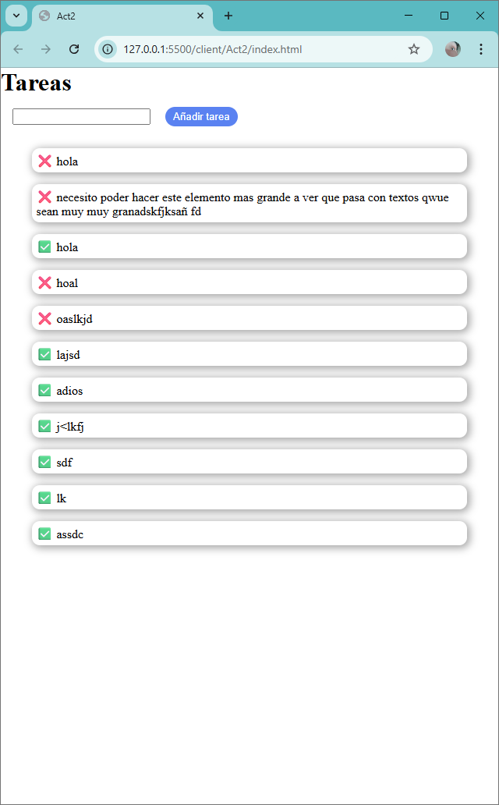

# Actividad

## Ejercicio 1: La Base - El Objeto Tarea Documentado

[Ir al enunciado completo](enunciado.md#ejercicio-1-la-base---el-objeto-tarea-documentado)

## Ejercicio 2: El Gestor Central - TaskManager (Patrón Singleton)

[Ir al enunciado completo](enunciado.md#ejercicio-2-el-gestor-central---taskmanager-patrón-singleton)

## Ejercicio 3: Notificación de Cambios - TaskManager Mejorado (Patrón Observer)

[Ir al enunciado completo](enunciado.md#ejercicio-3-notificación-de-cambios---taskmanager-mejorado-patrón-observer)

## Ejercicio 4: Creación Flexible - ElementoUIFactory (Patrón Factory)

[Ir al enunciado completo](enunciado.md#ejercicio-4-creación-flexible---elementouifactory-patrón-factory)
