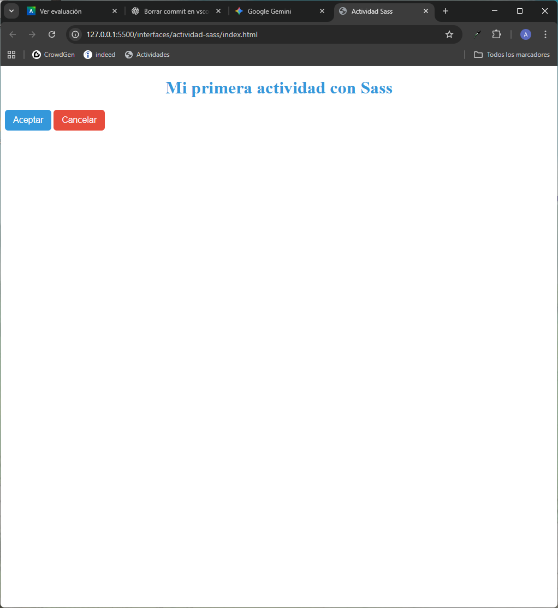

## 2.8. Actividad 2: Introducción a Sass

### Parte 1: Instalación de Sass

Me aseguro de que tengo instalado Node.js

````bash
alber@AlbertoEstepa MINGW64 ~/Desktop/2do/Interfaces (master)    
$ node -v
v22.16.0
````
Instalo Sass globalmente
````bash
alber@AlbertoEstepa MINGW64 ~/Desktop/2do/Interfaces (master)    
$ npm install -g sass

added 17 packages in 4s

5 packages are looking for funding
  run `npm fund` for details
npm notice
npm notice New major version of npm available! 10.9.2 -> 11.6.2
npm notice To update run: npm install -g npm@11.6.2
npm notice
````
Compruebo la instalación
````bash
alber@AlbertoEstepa MINGW64 ~/Desktop/2do/Interfaces (master)
$ sass --version
1.93.2 compiled with dart2js 3.9.3
````

Compilo con el siguiente comando
````bash
sass --watch scss/styles.scss css/styles.css
````
