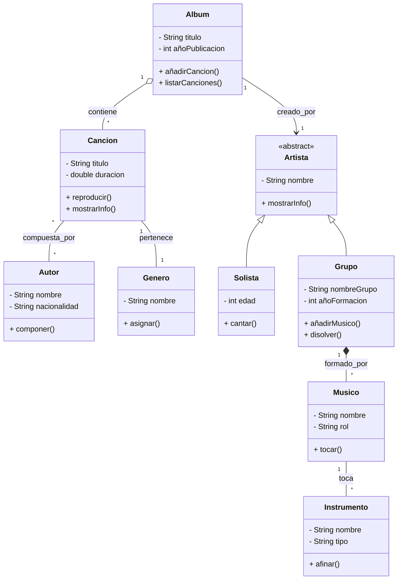

```mermaid
classDiagram
    class Cancion {
        - String titulo
        - double duracion
        + reproducir()
        + mostrarInfo()
    }

    class Album {
        - String titulo
        - int añoPublicacion
        + añadirCancion()
        + listarCanciones()
    }

    class Autor {
        - String nombre
        - String nacionalidad
        + componer()
    }

    class Genero {
        - String nombre
        + asignar()
    }

    class Artista {
        <<abstract>>
        - String nombre
        + mostrarInfo()
    }

    class Solista {
        - int edad
        + cantar()
    }

    class Grupo {
        - String nombreGrupo
        - int añoFormacion
        + añadirMusico()
        + disolver()
    }

    class Musico {
        - String nombre
        - String rol
        + tocar()
    }

    class Instrumento {
        - String nombre
        - String tipo
        + afinar()
    }

    %% Relaciones
    Album "1" o-- "*" Cancion : contiene
    Cancion "*" -- "*" Autor : compuesta_por
    Cancion "1" -- "1" Genero : pertenece
    Album "1" --> "1" Artista : creado_por
    Artista <|-- Solista
    Artista <|-- Grupo
    Grupo "1" *-- "*" Musico : formado_por
    Musico "1" -- "*" Instrumento : toca
```
